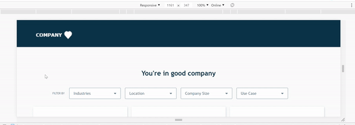

# Multi-filter Page
This project is a web page that displays multiple filters and returns paginated filtered results.

### 1. Technology stack:

- react
- redux
- redux-observable

### 2. Requirements:

- Node.js v10.15.1
- Yarn v1.10.1

### 3. Instructions:

1. Clone repo in your machine
2. run 'yarn install'
3. run 'yarn json-server'
4. run 'yarn start'

