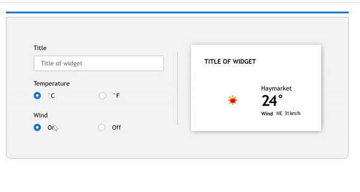

# Weather Widget
This project shows a weather widget and its editor. It fetches data from Open Weather Map API.

### 1. Technology stack:

- react (hooks)

### 2. Requirements:

- Node.js v10.15.1

### 3. Instructions:

1. Clone repository in your machine
3. run 'npm start'

